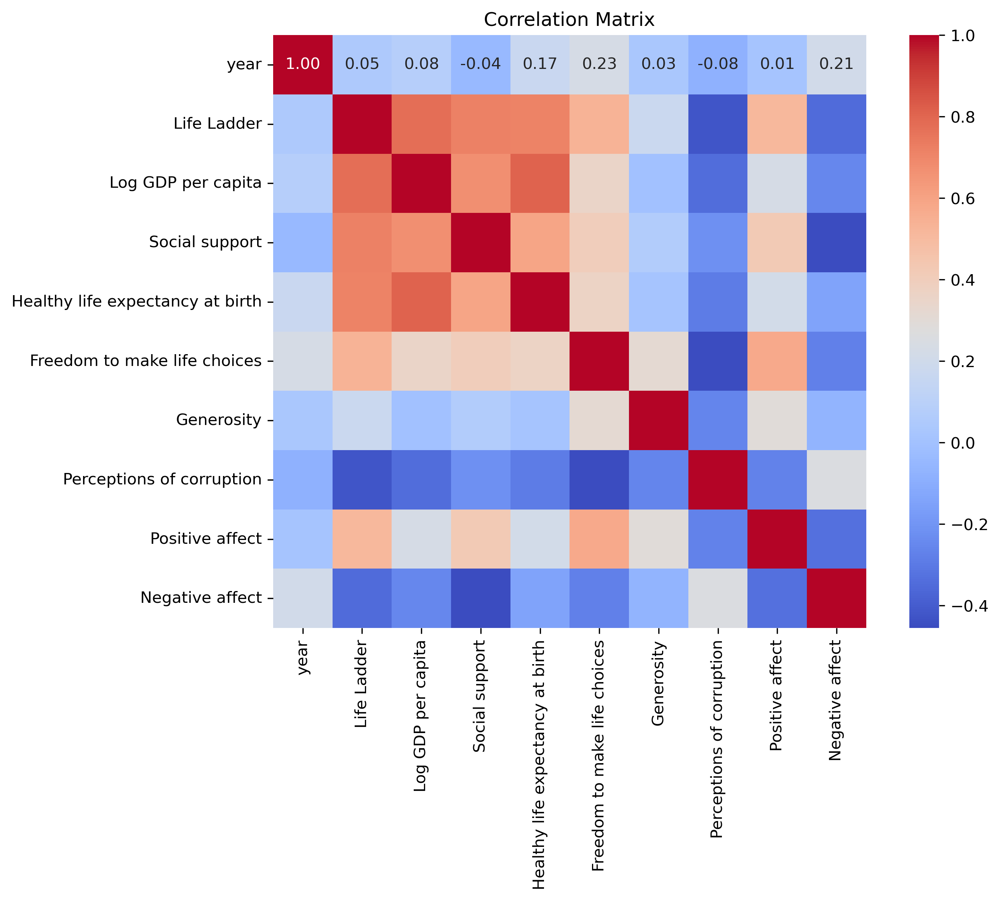
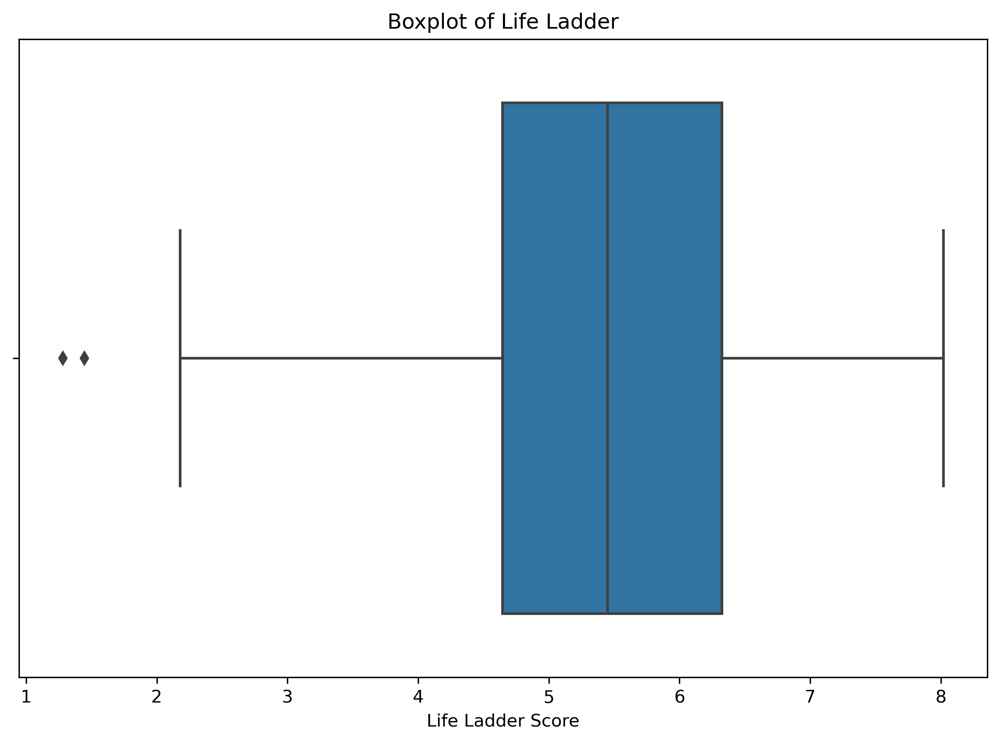
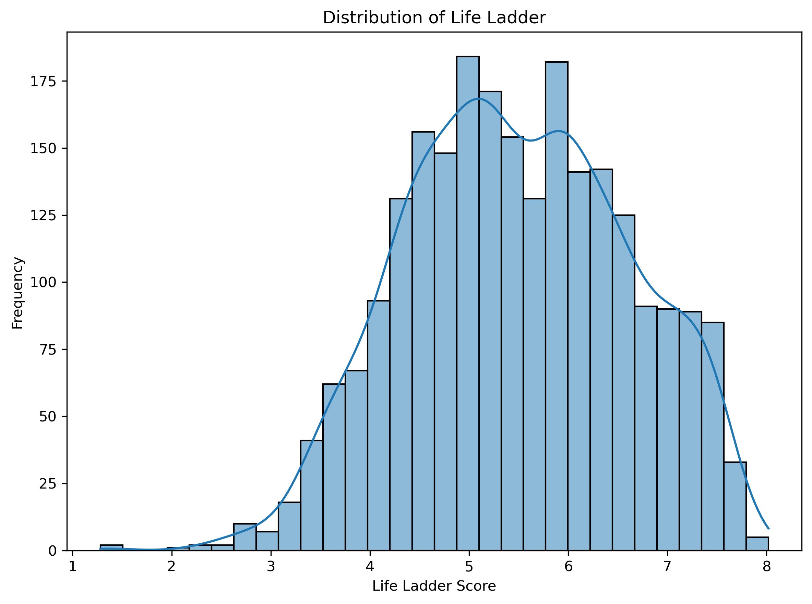
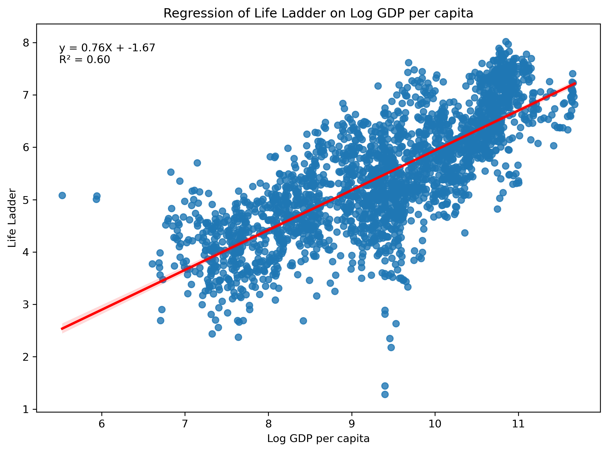

# Analysis of happiness.csv

## Overview

This analysis was conducted using an automated LLM pipeline. The dataset provided insights into various features, trends, and relationships among variables.

## Key Findings

### Summary of Results

The provided Python code processes a dataset containing happiness and socio-economic indicators. The steps involved include loading the data, handling missing values, generating statistical summaries, visualizing distributions, and performing a regression analysis to understand the relationship between GDP per capita and happiness measured by the "Life Ladder" score.

#### Key Insights:

1. **Initial Data Examination**:
   - The dataset contains various columns, including country names, year, and multiple socio-economic indicators. The first five rows display happiness scores for Afghanistan from 2008 to 2012, showing an overall increase in Life Ladder scores over the years.

2. **Missing Values**:
   - The check for missing values revealed significant gaps in the dataset, particularly in the "Generosity" and "Perceptions of corruption" columns, which had the most missing entries (81 and 125, respectively). Columns that had more than 50% missing values were dropped. Following this, other numerical columns were imputed with their respective mean values, resulting in no missing values remaining in the dataset.

3. **Descriptive Statistics**:
   - The descriptive statistics show that, on average, individuals reported a Life Ladder score of approximately 5.48 (on a scale from 0 to 10), with a standard deviation of 1.13. The life ladder scores ranged from a minimum of 1.28 to a maximum of 8.02. This indicates considerable variation in happiness levels across different observations.

4. **Categorical Analysis**:
   - The value counts of "Country name" help reveal the distribution of data among countries, with Lebanon, Jordan, Nicaragua, Nepal, and Moldova having the highest number of entries (18 each).

5. **Visualizations**:
   - The histogram of "Life Ladder" demonstrated the distribution of happiness scores, while the boxplot highlighted its central tendency and outliers. The correlation matrix indicated potential associations between the various numeric columns.

6. **Regression Analysis**:
   - A simple linear regression was conducted where "Life Ladder" was the dependent variable, and "Log GDP per capita" was the independent variable. The model showed that GDP per capita positively correlates with life satisfaction, with a coefficient of approximately 0.761 (indicating a strong positive relationship). The R-squared value of 0.599 suggests that about 60% of the variance in happiness scores can be explained by their GDP per capita. The regression results also confirmed statistically significant relationships (p < 0.001).

### Storylines and Insights:

1. **Impact of Economic Prosperity on Happiness**:
   - The analysis reaffirms the widely accepted notion that higher economic prosperity, as indicated by GDP per capita, tends to correlate with increased happiness levels. This highlights the importance of economic policies that aim to boost GDP per capita as a route to improving citizen well-being.

2. **Global Happiness Dynamics**:
   - With a broad dataset covering multiple countries over several years, researchers and policymakers can observe trends in happiness beyond mere economic numbers. For instance, countries like Afghanistan, despite the challenges faced, show a gradual improvement in happiness scores over time—suggesting resilience among its citizens.

3. **Focus on Multidimensional Well-being**:
   - While GDP is significant, it’s crucial to address gaps in other socio-economic indicators like social support, health, and freedom to make life choices for a more comprehensive strategy to enhance happiness. Some countries demonstrate great wealth but low satisfaction rates, prompting further investigation.

4. **Cultural and Societal Influences**:
   - Variations in happiness scores across different countries suggest that cultural, social, and political contexts play critical roles in shaping well-being. Policies tailored to local contexts can have a profound impact on enhancing citizens' quality of life.

5. **Calls for Further Research**:
   - The findings advocate for more nuanced analyses involving qualitative variables and more sophisticated modeling that could include additional factors, such as political stability and social norms, to enrich the understanding of the happiness phenomenon globally. 

In conclusion, the insights derived from the dataset and analyses emphasize the significant interconnections between economic factors and overall happiness while underscoring the need for a holistic approach to enhance people's well-being globally.

## Visualizations

The following charts were generated as part of the analysis:

**Explanation:** This chart represents Correlation Matrix.

**Explanation:** This chart represents Life Ladder Boxplot.

**Explanation:** This chart represents Life Ladder Histogram.

**Explanation:** This chart represents Regression Plot.

