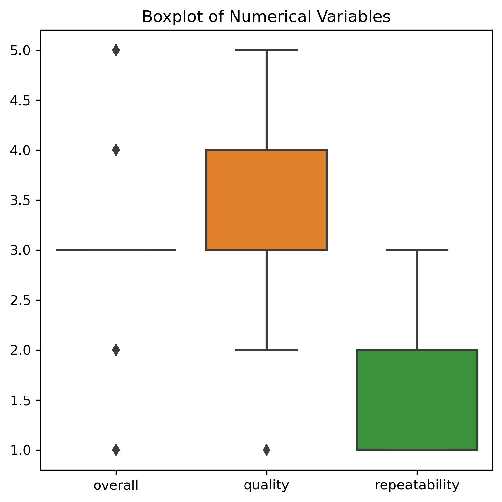
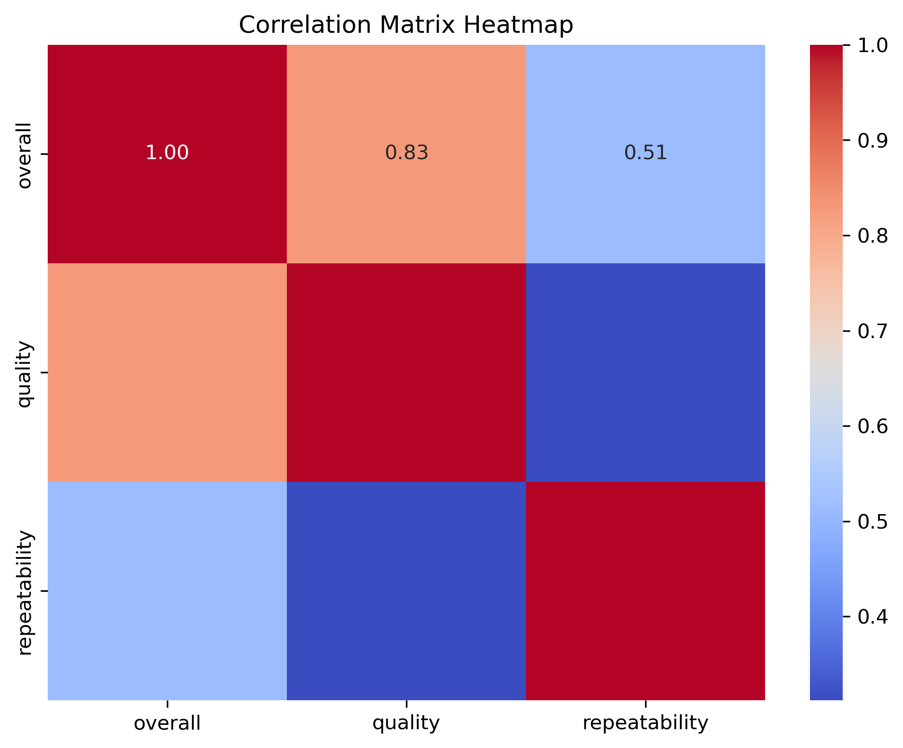
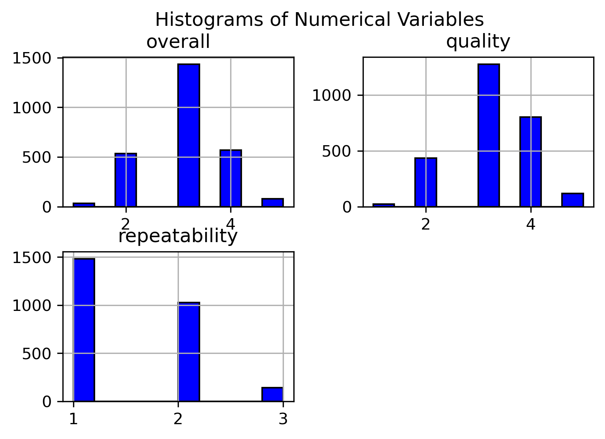
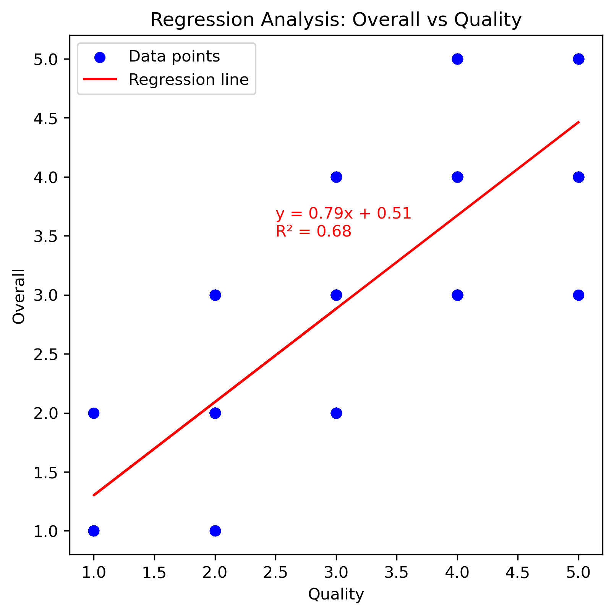

# Analysis of media.csv

## Overview

This analysis was conducted using an automated LLM pipeline. The dataset provided insights into various features, trends, and relationships among variables.

## Key Findings

Based on the provided code and the executed operations on the dataset `media.csv`, the following insights and storylines can be derived:

### Data Overview:
- **Total Records**: The dataset consists of 2,652 entries.
- **Missing Values**: After replacing the missing values in the 'by' column with 'Unknown', the only remaining missing values are in the 'date' column (99 entries). This suggests that there may be some data integrity issues related to how dates were recorded or formatted.

### Numerical Data Statistics:
- **Overall Ratings**:
  - Mean: 3.05, indicating a generally positive sentiment toward the media products.
  - The standard deviation (0.76) along with the min (1) and max (5) suggests a diverse range of overall ratings where some products are rated quite low while others receive the highest scores.
- **Quality Ratings**:
  - Mean: 3.21, similar in sentiment to overall ratings, which is consistent with the strong correlation found later.
  - The results indicate that most items receive a quality rating of 3 or 4.
- **Repeatability**:
  - With a mean of 1.49, the repeatability scores lower than overall and quality ratings suggest that audiences may not frequently revisit the content or that repeat views hold lower value.

### Categorical Data Insights:
- **Language**:
  - Most entries are in English (1,306 occurrences), which is reflective of audience preference but may indicate that the dataset potentially favors media in specific languages.
- **Type**:
  - The predominant type is movies (2,211 occurrences), indicating a skew towards cinematic content over other media forms.
- **Titles**:
  - There are a large number of unique titles (2,312), showing a wide variety of content. However, the top title "Kanda Naal Mudhal" indicates at least some specific works are particularly well-known or referenced.
  
### Correlation Matrix:
- A strong positive correlation exists between `overall` and `quality` (R² = 0.826), indicating that as quality ratings increase, overall ratings are also likely to increase. This suggests that improving quality could enhance how media is perceived overall.
- There is also a moderate correlation with `repeatability` (R² = 0.513) which implies that better quality media could lead to returning viewers; however, the correlation is weaker than between overall and quality scores.

### Regression Analysis:
- The linear regression analysis consistently emphasizes the relationship between `quality` and `overall`. The regression coefficient shows that for each unit increase in quality, the overall rating could be expected to increase significantly, which reinforces previous findings.
- R² score from the model confirms a strong predictive capability, supporting a strategic focus on improving media quality in order to boost overall audience satisfaction.

### Visualizations:
- The histograms and boxplots visually underscore a concentration of ratings around the average, reinforcing the summary statistics.
- The correlation heatmap clearly illustrates strong relationships between ratings, helpful for identifying focus areas for improvements in media content.

### Insights & Storylines:
- **Quality Focus**: Media producers should focus on enhancing the quality of their products as it appears to have a substantial positive impact on overall ratings.
- **Diverse Audience**: The dataset reflects a diverse array of media with varying levels of language representation, emphasizing the need for targeted outreach and content marketing strategies that accommodate different audience preferences.
- **Improvement Opportunity**: Given the modest level of repeatability, there may be opportunities to create more engaging or valuable content that encourages audiences to revisit or recommend the media, enhancing long-term engagement.

In conclusion, the dataset provides valuable insights into how quality correlates strongly with audience sentiments, and strategic improvements in media production could significantly enhance viewer retention and satisfaction.

## Visualizations

The following charts were generated as part of the analysis:

**Explanation:** This chart represents boxplot.

**Explanation:** This chart represents correlation heatmap.

**Explanation:** This chart represents histograms.

**Explanation:** This chart represents regression analysis.

